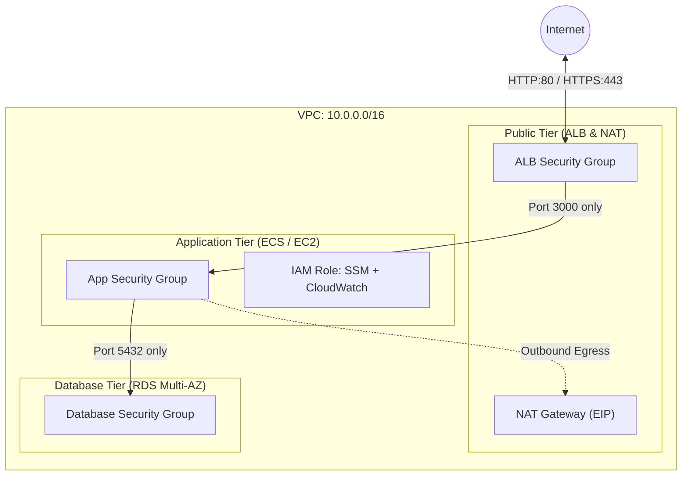

# AWS Modular Infrastructure with Terraform

[](https://www.terraform.io/)
[](https://registry.terraform.io/providers/hashicorp/aws/latest)
[](https://opensource.org/licenses/MIT)

Modular infrastructure as code repository provisioned on AWS using Terraform. Designed following multi-tier networking patterns, least-privilege security groups, IAM roles, and environment segregation.

---

## Architecture Overview



---

## Directory Structure

```text
.
??? environments/
?   ??? dev/
?   ?   ??? main.tf
?   ?   ??? variables.tf
?   ?   ??? outputs.tf
?   ?   ??? terraform.tfvars.example
?   ??? prod/
??? modules/
?   ??? vpc/
?   ?   ??? main.tf
?   ?   ??? variables.tf
?   ?   ??? outputs.tf
?   ??? security/
?   ?   ??? main.tf
?   ?   ??? variables.tf
?   ?   ??? outputs.tf
?   ??? compute/
?   ??? database/
?   ??? monitoring/
??? README.md
```

---

## Modules

### `vpc`
Provisions a dedicated VPC across multiple availability zones with three distinct subnet tiers:
- **Public Subnets**: Attached to an Internet Gateway for public load balancers and NAT gateways.
- **Private Subnets**: Routed through a NAT Gateway for secure outbound connectivity.
- **Database Subnets**: Completely isolated without internet routing.

### `security`
Implements layered security controls following the principle of least privilege:
- **`alb_sg`**: Accepts public inbound traffic on ports 80/443.
- **`app_sg`**: Restricts inbound traffic strictly to the ALB security group on the application port.
- **`db_sg`**: Restricts inbound database traffic strictly to the application security group.
- **`app_role`**: IAM role configured with `AmazonSSMManagedInstanceCore` (eliminating open SSH ports) and `CloudWatchAgentServerPolicy`.

#### Inputs
| Module | Name | Description | Type | Default |
| :--- | :--- | :--- | :--- | :--- |
| `vpc` | `vpc_cidr` | CIDR block for the VPC | `string` | `10.0.0.0/16` |
| `vpc` | `environment` | Deployment environment identifier | `string` | - |
| `vpc` | `availability_zones` | Target AZs for high availability | `list(string)` | `["us-east-1a", "us-east-1b"]` |
| `security` | `vpc_id` | Target VPC identifier | `string` | - |
| `security` | `app_port` | Application exposed TCP port | `number` | `3000` |
| `security` | `db_port` | Database TCP port | `number` | `5432` |

#### Outputs
| Module | Name | Description |
| :--- | :--- | :--- |
| `vpc` | `vpc_id` | ID of the created VPC |
| `vpc` | `public_subnet_ids` | IDs of public subnets |
| `vpc` | `private_subnet_ids` | IDs of private subnets |
| `vpc` | `database_subnet_ids` | IDs of isolated database subnets |
| `security` | `alb_security_group_id` | Security group ID for ALB |
| `security` | `app_security_group_id` | Security group ID for Application |
| `security` | `database_security_group_id` | Security group ID for Database |
| `security` | `app_iam_role_arn` | ARN of the application IAM role |

---

## Getting Started

### Requirements
- Terraform >= 1.5.0
- AWS CLI configured with appropriate permissions

### Deployment
```bash
cd environments/dev

# Initialize backend and modules
terraform init

# Validate configuration
terraform validate

# Review execution plan
terraform plan
```

---

## Author

**Lucas Robiati**  
[LinkedIn](https://www.linkedin.com/in/lucas-robiati-129795133/) | [GitHub](https://github.com/Casiati)
