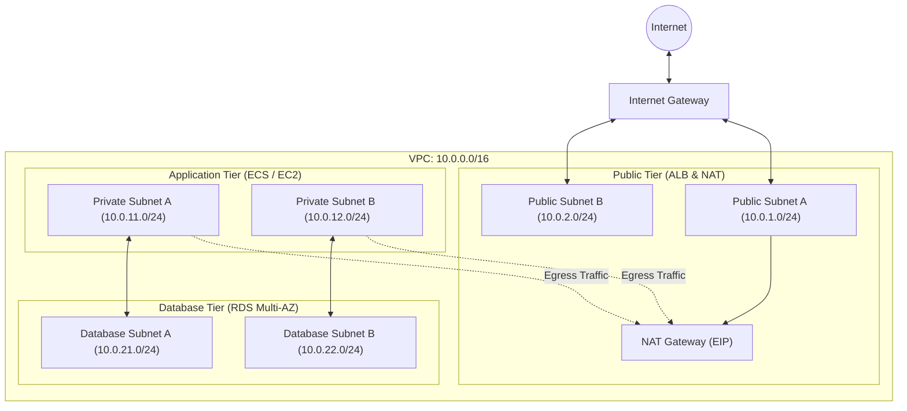

# AWS Modular Infrastructure with Terraform

[](https://www.terraform.io/)
[](https://registry.terraform.io/providers/hashicorp/aws/latest)
[](https://opensource.org/licenses/MIT)

Modular infrastructure as code repository provisioned on AWS using Terraform. Designed following multi-tier networking patterns, security isolation, and environment segregation.

---

## Architecture Overview



---

## Directory Structure

```text
.
??? environments/
?   ??? dev/
?   ?   ??? main.tf
?   ?   ??? variables.tf
?   ?   ??? outputs.tf
?   ?   ??? terraform.tfvars.example
?   ??? prod/
??? modules/
?   ??? vpc/
?   ?   ??? main.tf
?   ?   ??? variables.tf
?   ?   ??? outputs.tf
?   ??? security/
?   ??? compute/
?   ??? database/
?   ??? monitoring/
??? README.md
```

---

## Modules

### `vpc`
Provisions a dedicated VPC across multiple availability zones with three distinct subnet tiers:
- **Public Subnets**: Attached to an Internet Gateway for public load balancers and NAT gateways.
- **Private Subnets**: Routed through a NAT Gateway for secure outbound connectivity.
- **Database Subnets**: Completely isolated without internet routing.

#### Inputs
| Name | Description | Type | Default |
| :--- | :--- | :--- | :--- |
| `vpc_cidr` | CIDR block for the VPC | `string` | `10.0.0.0/16` |
| `environment` | Deployment environment identifier | `string` | - |
| `availability_zones` | Target AZs for high availability | `list(string)` | `["us-east-1a", "us-east-1b"]` |
| `public_subnet_cidrs` | CIDRs for public subnets | `list(string)` | `["10.0.1.0/24", "10.0.2.0/24"]` |
| `private_subnet_cidrs` | CIDRs for private application subnets | `list(string)` | `["10.0.11.0/24", "10.0.12.0/24"]` |
| `database_subnet_cidrs` | CIDRs for database subnets | `list(string)` | `["10.0.21.0/24", "10.0.22.0/24"]` |
| `enable_nat_gateway` | Controls NAT Gateway provisioning | `bool` | `true` |

#### Outputs
| Name | Description |
| :--- | :--- |
| `vpc_id` | ID of the created VPC |
| `public_subnet_ids` | IDs of public subnets |
| `private_subnet_ids` | IDs of private subnets |
| `database_subnet_ids` | IDs of isolated database subnets |
| `nat_gateway_id` | ID of the NAT Gateway |

---

## Getting Started

### Requirements
- Terraform >= 1.5.0
- AWS CLI configured with appropriate permissions

### Deployment
```bash
cd environments/dev

# Initialize backend and modules
terraform init

# Validate configuration
terraform validate

# Review execution plan
terraform plan
```

---

## Author

**Lucas Robiati**  
[LinkedIn](https://www.linkedin.com/in/lucas-robiati-129795133/) | [GitHub](https://github.com/Casiati)
